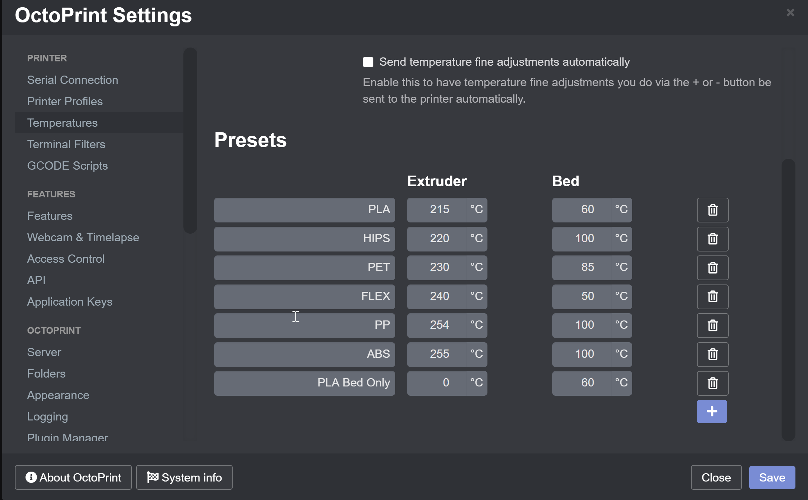
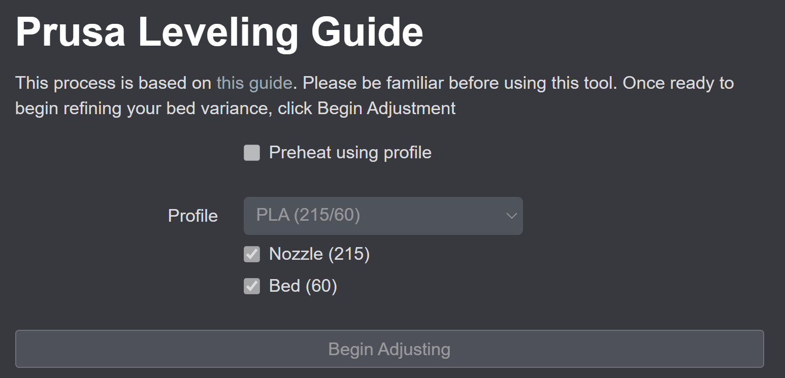
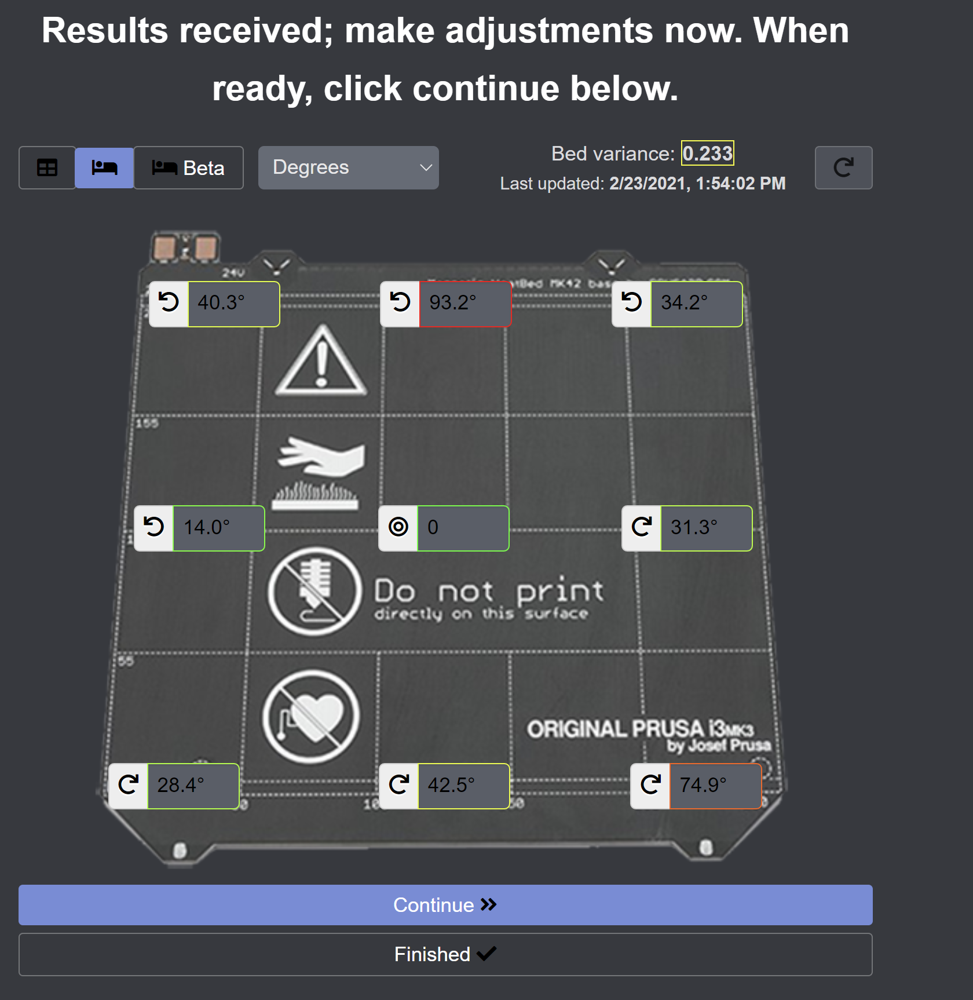

# OctoPrint-PrusaLevelingGuide

This plugin is for guiding the user through fine adjustments of the bed.  Some of these mods are linked in the Guides section below.  This plugin is only intended for the Prusa MK3 and its variants (MK3, MK3S, MK3S+).  It does not support the partial upgrade MK3.5.

## Setup

Install via the bundled [Plugin Manager](https://github.com/foosel/OctoPrint/wiki/Plugin:-Plugin-Manager)
or manually using this URL:

    https://github.com/scottrini/OctoPrint-PrusaLevelingGuide/archive/master.zip

## Guides

* [Silicone Mod for the MK3](https://www.schweinert.com/silicone-bed-level-mod-prusa-mk3)
* [Silicone Mod for the MINI](https://github.com/bbbenji/PMSBLM)
* [Nylock Mod for the MK3S](https://www.rearvuemirror.com/guides/nylock-mod-for-the-mk3s)
* [Bed Leveling without Wave Springs](https://github.com/PrusaOwners/prusaowners/wiki/Bed_Leveling_without_Wave_Springs)

## Known Issues
* Installation may silently fail due to missing system dependencies. **You should upgrade to OctoPi 0.18+** or SSH into your pi and run the command `sudo apt install libatlas3-base`.
* This plugin will calculate the relative values for you and will not work with firmware modifications that change the G81 response.
* Z Calibration can effect bed leveling. If you re-calibrate your Z-axis after leveling your bed, it might look like the whole left or right side of the bed is suddenly higer/lower than the other side. The reason for this is, that the Z-axis leadscrews might have changed their angular position relative to each other due to soft mechanical upper stops. If this is the case, try to rotate one of the leadscrews by hand by one or two clicks instead of re-adjusting the bed again.

## Preheating profiles

The profiles listed for preheating are the temperature profiles defined in octoprint.  To define more, browse to Settings->Temperatures.  You can also define temperature profiles that just preheat the bed, just the nozzle, or use the default ones that preheat both.

## 7x7 vs 3x3 for adjustments

Previously, this plugin used `G80 N3` to enforce using 3x3 bed leveling in the default gcode.  Without the `N3`, it would use whatever you have configured in the firmware.  The `N3` is no longer in the default settings, but you might still have it configured if you've updated from a previous version.  If you'd like to use what is configured on your printer, make sure the `N3` is *not* present in your settings.

## Adjusting your bed

Once you're ready to adjust using this plugin, pull up the tab in your octoprint instance.  Decide if you want to preheat the bed while making adjustments.  Preheating isn't absolutely necessary for your initial adjustments, but really fine tuning the bed should be done preheated, as the values will change when things are heated.

So select your profile and whether to preheat, then click begin adjusting.  The plugin will:
- Preheat (if enabled)
- Send the mesh level command and retrieve results
- Wait for the command to complete
- Send gcode to move the bed and extruder out of the way
- Update the UI with the values

Once the UI is updated, the status will change to *Waiting for continue*.  This is your opportunity to adjust the screws.  The raw value view does not provide the direction to turn the screws.  If it's a negative value, loosen the screw.  If it's positive, tighten the screw.

All of the other views will disable an arrow next to the value to show which direction to rotate the screw.  Once you've made your adjustments, click continue to start another mesh check and update the UI with the new values.  If you've gotten your bed to a variance you're happy with, click **Finished**.  If the printer was preheated, this will disable the preheating.

*TODO: Allow configuration of a 'target bed variance' and alert whenever the bed is higher than the target variance - will only work if you configure your print start/print finish gcode to include G81*

You have the option of viewing the values in a table view or overlayed on a photo of the heatbed.  You can also customize whether you view raw values, degrees, decimal turns, or factional turns.

**Configuration View**

**Beta Bed View**

**Bed View**

**Table View**

## Configuration

The configuration tab allows you to customize the gcode for mesh leveling similar to the PrusaMeshMap plugin.

## Inspirations

- [Bed Leveling without Wave Springs](https://github.com/PrusaOwners/prusaowners/wiki/Bed_Leveling_without_Wave_Springs) obviously I would not have written this plugin without this awesome mod/guide
- [OctoPrint-PrusaMeshMap](https://github.com/PrusaOwners/OctoPrint-PrusaMeshMap) This is the plugin I used previously to adjust my bed.  It works, but I wanted something a little more automated.  Some of the code for detecting g81 response was used from this plugin.
- [g81_level_guide](https://gitlab.com/gnat.org/g81_level_guide) I like the idea of this script because it automates the process, but I didn't like that it clears my preheat when connecting and that it was a pain to get running on a pi.  The idea inspired me to write this plugin.
- [g81_relative](https://github.com/pcboy/g81_relative) This is the site I originally used for converting my g81 values to relative numbers.  This is what inspired me to add all the different calculation types.

## G81 Output Handler

Just like the PrusaMeshMap plugin, this plugin has a handler that is watching output received from the printer **at all times**. This means you can place a G81 in octoprint's or your slicer's start or stop gcode and the plugin will update its values after every print.

## Z Calibration can effect bed leveling

Note from *Spacemarine2018*

If you re-calibrate your Z-axis after leveling your bed, it might look like the whole left or right side of the bed is suddenly higer/lower than the other side. The reason for this is, that the Z-axis leadscrews might have changed their angular position relative to each other due to soft mechanical upper stops. If this is the case, try to rotate one of the leadscrews by hand by one or two clicks instead of re-adjusting the bed again.
