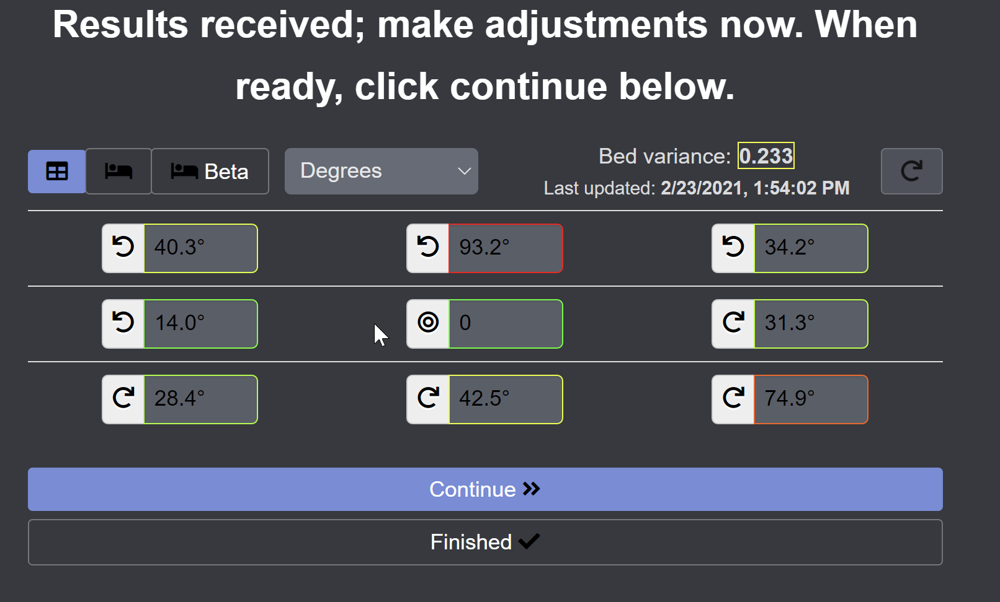
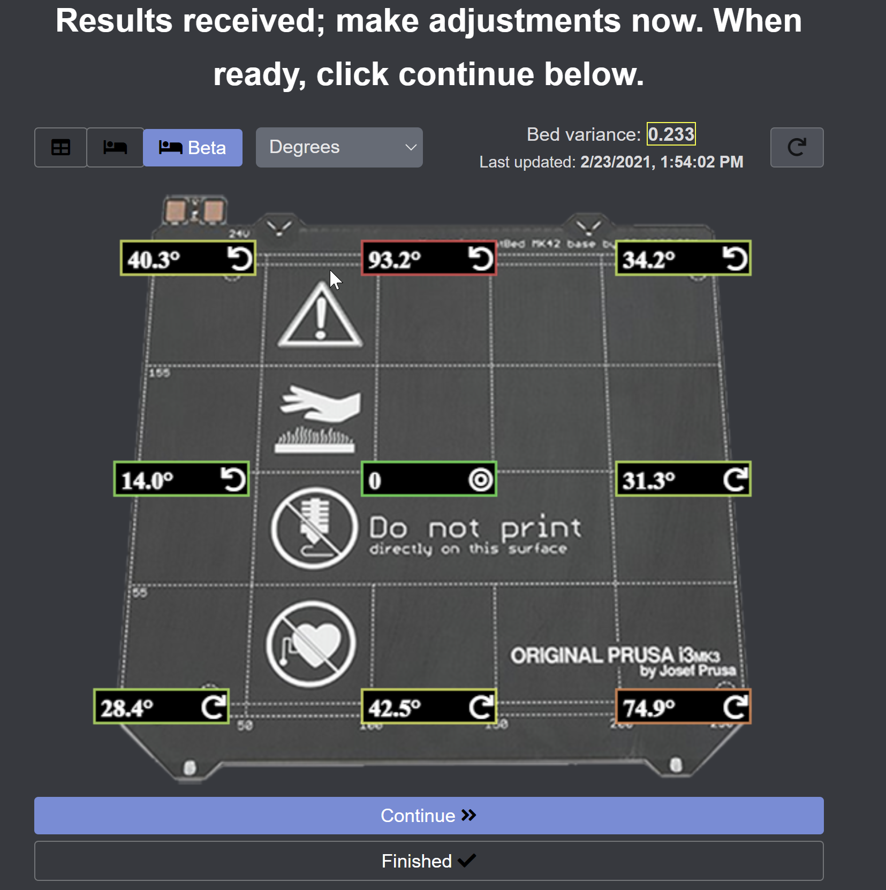
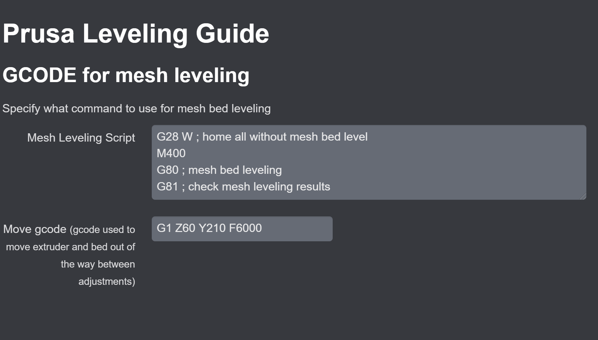

# OctoPrint-PrusaLevelingGuide

This plugin provides assistance that will help you level your bed manually.

It is intended for use with the Nylock or Silicone mods for Prusa printers but can also be helpful for any printbed that allows adjustments.

For each round of adjustment, the plugin will send the configured mesh level code and gcode for retrieving values (generally G80/G81 or G28/G29).

Once values are received, you can view how to adjust your bed then click continue to proceed with another round of leveling or click finish.

You have the option of viewing the values in a table view or overlayed on a photo of the heatbed.

You can also customize whether you view raw values, degrees, decimal turns, or factional turns.

## Setup

Install via the bundled [Plugin Manager](https://github.com/foosel/OctoPrint/wiki/Plugin:-Plugin-Manager) or manually using this URL:

https://github.com/scottrini/OctoPrint-PrusaLevelingGuide/archive/master.zip

## Supported Firmware

- PrusaFirmware
- Marlin/Buddy

## Guides

* [Silicone Mod for the MK3](https://www.schweinert.com/silicone-bed-level-mod-prusa-mk3)
* [Silicone Mod for the MINI](https://github.com/bbbenji/PMSBLM)
* [Nylock Mod for the MK3S](https://www.rearvuemirror.com/guides/nylock-mod-for-the-mk3s)
* [Bed Leveling without Wave Springs](https://github.com/PrusaOwners/prusaowners/wiki/Bed_Leveling_without_Wave_Springs)

## Dependencies
* [python3](https://www.python.org/doc/sunset-python-2/)
* [regex](https://pypi.org/project/regex/)
* [numpy](https://numpy.org/)
* [scipy](https://www.scipy.org/)

## Known Issues
* Installation may silently fail due to missing system dependencies. **You should upgrade to OctoPi 0.18+** or SSH into your pi and run the command `sudo apt install libatlas3-base`.
* This plugin will calculate the relative values for you and will not work with firmware modifications that change the G81 response.
* Z Calibration can effect bed leveling. If you re-calibrate your Z-axis after leveling your bed, it might look like the whole left or right side of the bed is suddenly higer/lower than the other side. The reason for this is, that the Z-axis leadscrews might have changed their angular position relative to each other due to soft mechanical upper stops. If this is the case, try to rotate one of the leadscrews by hand by one or two clicks instead of re-adjusting the bed again.

## Adjusting your bed

Once you're ready to adjust using this plugin, pull up the tab in your octoprint instance.  Decide if you want to preheat the bed while making adjustments.  Preheating isn't absolutely necessary for your initial adjustments, but really fine tuning the bed should be done preheated, as the values will change when things are heated.

So select your profile and whether to preheat, then click begin adjusting.  The plugin will:
- Preheat (if enabled)
- Send the mesh level command and retrieve results
- Wait for the command to complete
- Send gcode to move the bed and extruder out of the way
- Update the UI with the values

Once the UI is updated, the status will change to *Waiting for continue*.  This is your opportunity to adjust the screws.  The raw value view does not provide the direction to turn the screws.  If it's a negative value, loosen the screw.  If it's positive, tighten the screw.

All of the other views will disable an arrow next to the value to show which direction to rotate the screw.  Once you've made your adjustments, click continue to start another mesh check and update the UI with the new values.  If you've gotten your bed to a variance you're happy with, click **Finished**.  If the printer was preheated, this will disable the preheating.

## G81/G29 Output Handler

Just like the PrusaMeshMap plugin, this plugin has a handler that is watching output received from the printer **at all times**. This means you can place a G81 or G29 in octoprint's or your slicer's start or stop gcode and the plugin will update its values after every print.

## Screenshots

### Table View

### Bed View

### Configuration

## Inspirations

- [Bed Leveling without Wave Springs](https://github.com/PrusaOwners/prusaowners/wiki/Bed_Leveling_without_Wave_Springs) obviously I would not have written this plugin without this awesome mod/guide
- [OctoPrint-PrusaMeshMap](https://github.com/PrusaOwners/OctoPrint-PrusaMeshMap) This is the plugin I used previously to adjust my bed.  It works, but I wanted something a little more automated.  Some of the code for detecting g81 response was used from this plugin.
- [g81_level_guide](https://gitlab.com/gnat.org/g81_level_guide) I like the idea of this script because it automates the process, but I didn't like that it clears my preheat when connecting and that it was a pain to get running on a pi.  The idea inspired me to write this plugin.
- [g81_relative](https://github.com/pcboy/g81_relative) This is the site I originally used for converting my g81 values to relative numbers.  This is what inspired me to add all the different calculation types.
- [Prusa Mini Silicone Bed Leveling Mod](https://bbbenji.github.io/PMSBLM/) This calculator inspired an approach to handling even-sized probe grids such as found in the Prusa MINI.
